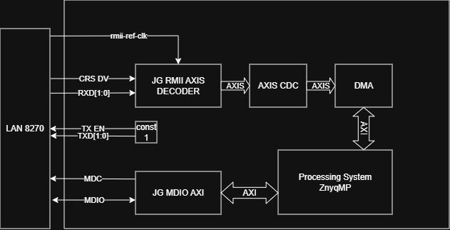

# jg_rmii_eth

[](https://github.com/jakobgross/jg_rmii_eth/actions/workflows/cocotb_sim.yml)
[](https://github.com/jakobgross/jg_rmii_eth/actions/workflows/ghdl_sim.yml)

MDIO AXI controller and RMII-to-AXI-Stream decoder for Xilinx Zynq-7000, packaged as Vivado IPs. Includes frame detection and CRC-32 checking. Receive only. Example project targets the Digilent Zybo Z7-20.

Developed and tested with Vivado 2021.2 and Vitis 2021.2.

## Status

### jg_mdio_axi

- [x] MDIO controller (`jg_mdio_ctrl`)
- [x] MDIO controller testbench
- [x] LAN8720 readback module (`jg_lan8720_readback`)
- [x] LAN8720 bring-up state machine (`jg_lan8720_ctrl`)
- [x] LAN8720 ctrl testbench
- [ ] VUnit or CocoTB simulation flow
- [ ] Formal verification (SymbiYosys)
- [x] Packaged as Vivado IP

### jg_rmii_axis_decoder

- [x] RMII dibit aligner and byte packer (`jg_rmii_to_bytes`)
- [x] `jg_rmii_to_bytes` testbench (8 edge case tests)
- [x] CRC-32 engine and FCS stripper (`jg_eth_crc`)
- [x] 32-bit AXI-Stream word builder (`jg_rmii_axis_decoder`)
- [x] `jg_rmii_axis_decoder` testbench (good frame, bad CRC, back-pressure, stress)
- [x] CocoTB simulation flow
- [ ] Formal verification - `jg_rmii_to_bytes`
- [ ] Formal verification - `jg_eth_crc`
- [ ] Formal verification - `jg_rmii_axis_decoder` (AXI-Stream PSL properties)
- [x] Packaged as Vivado IP

### Example Project

- [x] Vivado block design (TCL script)
- [x] Vitis bare-metal application
- [x] Running on hardware: MDIO polling over UART
- [x] Running on hardware: AXI DMA scatter-gather frame capture over UART

> **Simulation framework:** I have not yet decided on VUnit or CocoTB. I will choose whatever sparks more interest in me in the next weeks.

---

### Components

- Digilent Zybo Z7-20
- Waveshare LAN8720 ETH Board

### Wiring - LAN8720 to PMOD JE

The Waveshare LAN8720 board is connected **upside down** to PMOD JE. Mounted this way the VCC and GND pins of the module align correctly with the PMOD power rails. The TX pins of the LAN8720 remain unconnected.

> **Note:** This project is receive-only (RX). No Ethernet frames are transmitted by the FPGA.

| PMOD JE Pin | Package Pin | Signal        | Direction | LAN8720 Pin  |
|-------------|-------------|---------------|-----------|--------------|
| JE2         | W16         | RXD[1]        | In        | RXD1         |
| JE3         | J15         | CRS_DV        | In        | CRS_DV       |
| JE4         | H15         | MDC           | Out       | MDC          |
| JE8         | U17         | RXD[0]        | In        | RXD0         |
| JE9         | T17         | nINT/REFCLK   | In        | nINT/REFCLK (50 MHz) |
| JE10        | Y17         | MDIO          | Bidir     | MDIO         |

**PHY SMI address: 1** - The Waveshare board pulls RXER/PHYAD0 high via a resistor to VCC, setting the PHY address to 1 (not the default 0).

**MODE[2:0] = 111** - RXD0, RXD1 and CRS_DV are pulled high internally, enabling auto-negotiation. No BCR write required.

### Linux Test Machine

Any Linux machine with a spare Ethernet port connected directly to the Zybo LAN8720 via a straight-through cable. Auto-MDIX handles polarity automatically. No switch or router required. The interface must not be managed by NetworkManager during testing.

Scapy must be installed:

```bash
pip install scapy
```

```sh
# Bring up the interface without IP assignment
ip link set eth0 up

# Send a test frame with Scapy
python3 -c "
from scapy.all import *
sendp(Ether(dst='ff:ff:ff:ff:ff:ff')/IP(dst='255.255.255.255')/UDP()/b'hello', iface='eth0')
"
```


---

## Architecture

### Block Overview



### Vivado Block Design


Example Project Vivado IP Integrator block design

---

## Build

### Make targets

Vivado targets (`project`, `bitstream`, `xsa`) require Vivado on the system PATH. Vitis targets (`vitis`, `vitis_update`) require XSCT on the system PATH. Source the appropriate settings script from your installation directory before running make:

```bash
# Linux
source <vivado_install_dir>/settings64.sh

# Windows
call <vivado_install_dir>\settings64.bat
```


```
make project          Recreate Vivado example project from scripts/build.tcl
make bitstream        Run synthesis, implementation and generate bitstream
make xsa              Export hardware description to example/sw/top.xsa
make vitis            Recreate Vitis workspace from scripts/vitis_create.tcl
make vitis_update     Update sources in existing Vitis workspace and rebuild
make sim              Run all GHDL simulations
make sim_cocotb       Run cocotb/GHDL simulations 
make formal           Run all SymbiYosys proofs
make clean            Remove all generated build artifacts
```

Run `make help` for the full target list and variable overrides.

### CocoTB

The RMII AXIS decoder now also has a cocotb testbench driven through GHDL:

```bash
make sim_rmii_axis_decoder_cocotb
```

Requirements:

```bash
ghdl --version
python3 -m pip install cocotb cocotbext-axi scapy
```

The cocotb testbench is implemented in `sim/jg_rmii_axis_decoder_coco.py` and uses:

- `cocotb` for the Python testbench runtime
- `cocotbext-axi` for the AXI-Stream sink
- `scapy` to build Ethernet frame bytes
- `ghdl` as the simulator backend

Scapy is used in an offline packet-construction mode inside the testbench, so no physical network interface is required for local runs or CI.

Example passing output:

```text
******************************************************************************************************************************
** TEST                                                                  STATUS  SIM TIME (ns)  REAL TIME (s)  RATIO (ns/s) **
******************************************************************************************************************************
** jg_rmii_axis_decoder_coco.test_good_header_only_frame                  PASS        2430.00           0.01     163955.97  **
** jg_rmii_axis_decoder_coco.test_bad_crc_sets_tuser                      PASS        5870.00           0.02     348392.71  **
** jg_rmii_axis_decoder_coco.test_bad_sfd_produces_no_axis_frame          PASS        7990.00           0.01     745185.65  **
** jg_rmii_axis_decoder_coco.test_backpressure_increments_words_dropped   PASS       15750.00           0.03     494355.93  **
******************************************************************************************************************************
** TESTS=4 PASS=4 FAIL=0 SKIP=0                                                      32040.00           0.09     353075.59  **
******************************************************************************************************************************
```

### Saving changes back to the repository

After making changes interactively in Vivado, regenerate `scripts/build.tcl` from the Vivado Tcl console (run from inside `example/vivado/jg_rmii_eth_example/`):

```tcl
write_project_tcl -force \
    -target_proj_dir example/vivado \
    -origin_dir_override scripts \
    ../../scripts/build.tcl
```

---

## Example Output

### Startup output

On power-up the application reads PHY identity and link status over MDIO and prints them over UART:

```
=== jg_rmii_eth example ===
DMA ready. Waiting for frames...
=== LAN8720 PHY ===
  ID1=0x0007  ID2=0x0007
  BSR=0x7809  Link=DOWN  AN=pending
  PSCSR=0x7809

  BSR=0x782D  Link=UP  AN=complete
  PSCSR=0x782D
```

The BSR line is reprinted whenever the link status changes. Once the link comes up, frames will start appearing.

### Sending a test frame from the Linux machine

```bash
sudo python3 -c "from scapy.all import *; \
  sendp(Ether()/IP(dst='255.255.255.255')/UDP()/\
b'hello world from jg-rmii-eth Jakobs Lan8720-RMII to AXI-Stream', iface='eth0')"
```

Expected output on the Zybo UART:

```
--- Frame 105 bytes  TUSER=0 ---
ETH  DST=CC:CE:1E:C5:D4:AE  SRC=2C:CF:67:AE:14:08  IPv4
     SRC=192.168.178.190  DST=255.255.255.255  TTL=64  UDP  SRC_PORT=53  DST_PORT=53
     Payload 62 bytes:
68 65 6C 6C 6F 20 77 6F 72 6C 64 20 66 72 6F 6D   hello world from
20 6A 67 2D 72 6D 69 69 2D 65 74 68 20 4A 61 6B    jg-rmii-eth Jak
6F 62 73 20 4C 61 6E 38 37 32 30 2D 52 4D 49 49   obs Lan8720-RMII
20 74 6F 20 41 58 49 2D 53 74 72 65 61 6D          to AXI-Stream
```

### Background traffic

Once the link is up you will immediately see background traffic from the Linux machine - this is normal. Common frames include:

**DHCP Discover** (Linux machine looking for an IP address):
```
--- Frame 329 bytes  TUSER=0 ---
ETH  DST=FF:FF:FF:FF:FF:FF  SRC=2C:CF:67:AE:14:07  IPv4
     SRC=0.0.0.0  DST=255.255.255.255  TTL=64  UDP  SRC_PORT=68  DST_PORT=67
     Payload 286 bytes:
...
```

**ICMPv6 Router Solicitation** (IPv6 neighbour discovery):
```
--- Frame 63 bytes  TUSER=0 ---
ETH  DST=33:33:00:00:00:02  SRC=2C:CF:67:AE:14:07  IPv6
     SRC=FE80:0000:0000:0000:2ECF:67FF:FEAE:1407
     DST=FF02:0000:0000:0000:0000:0000:0000:0002
     ICMPv6  type=133  code=0
```

---

## Repository Structure

```
jg_rmii_eth/
├── jg_mdio_axi_1.0/              Vivado IP: MDIO AXI controller
│   ├── hdl/                      jg_mdio_ctrl.vhd, jg_mdio_axi.vhd
│   ├── bd/
│   ├── drivers/
│   ├── xgui/
│   └── component.xml
├── jg_rmii_axis_decoder_1.0/     Vivado IP: RMII-to-AXI-Stream decoder
│   ├── hdl/                      jg_rmii_to_bytes.vhd, jg_eth_crc.vhd, jg_rmii_axis_decoder.vhd
│   ├── bd/
│   ├── xgui/
│   └── component.xml
├── sim/                          VHDL testbenches for all modules
├── formal/                       SymbiYosys proofs and PSL properties
├── scripts/                      TCL scripts for Vivado and Vitis
├── example/
│   ├── constraints/              XDC pin assignments for Zybo Z7-20
│   ├── vivado/                   Generated Vivado project (gitignored)
│   ├── vitis/                    Generated Vitis workspace (gitignored)
│   └── sw/src/                   Bare-metal C application
├── Makefile
├── LICENSE
└── README.md
```

---

## Documentation

- [LAN8720A/LAN8720Ai Datasheet](https://ww1.microchip.com/downloads/en/DeviceDoc/en557323.pdf) - Small Footprint RMII 10/100 Ethernet Transceiver with HP Auto-MDIX Support, SMSC
- [Waveshare LAN8720 ETH Board Schematic](https://www.waveshare.com/w/upload/0/08/LAN8720-ETH-Board-Schematic.pdf) - Board schematic showing RXER/PHYAD0 pull-up to VCC and MODE strap connections
- Ethernet: Reduced Media Independent Interface (RMII) specification Rev 1.2

---

## License

Apache 2.0 - see [LICENSE](LICENSE).
